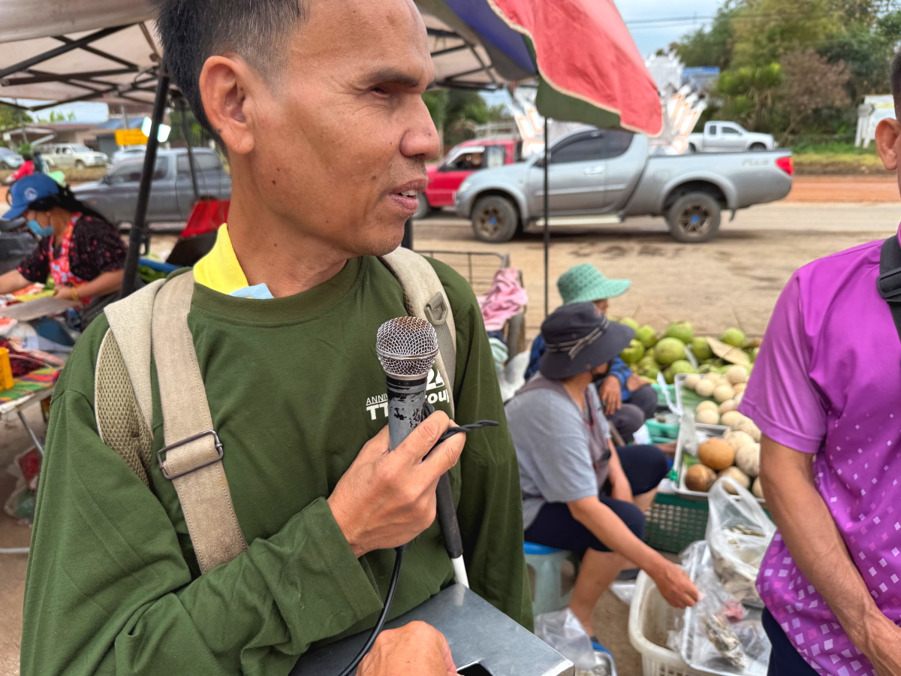

# 20250225_chiangrai

<html>
<head>

<meta charset="UTF-8">
<meta http-equiv="Content-Type" content="text/html; charset=UTF-8">
<meta http-equiv="X-UA-Compatible" content="IE=EmulateIE10" />
<meta http-equiv="X-UA-Compatible" content="IE=edge">

<meta name="viewport" content="width=device-width, initial-scale=1.0">

<!--ここから上はお決まりの定型文です-->

<!--ここからが表現の書式などを決めるcssという部分-->

<link href="https://cdnjs.cloudflare.com/ajax/libs/lightbox2/2.7.1/css/lightbox.css" rel="stylesheet">

</head>

<body>

モバイル端末をお使いの場合は、画面を横向きにすると
より見やすくご覧頂けます。

<!--ここ上は、ほぼそのまま使います！-->

<!--QRコードの挿入例-->

 アクセス用QRコード

<marquee direction="left" scrollamount="20" width="30%">(^_^)/~alis</marquee>

<!--流れ文字の挿入例-->
<h1><marquee behavior="left">!!! 2025/02/25、道路工事が一斉にスタート、市場で盲人に寄付してその後はショッピングモールに!!!</marquee></h1>

                          

<!--ここから下が、本体部分-->

<h2>二日続けて空が曇って朝焼けはイマイチ 朝7:23</h2>

    
<h2>微かな隙間からオレンジ色が覗きました</h2>

    
<h2>雨季の暑さに備えて鉢を日陰に移動したら、紫の蓮が寝ちゃいました</h2>

    
<h2>避妊手術した猫ちゃんはカゴに閉じ込められて不満顔</h2>

    
<h2>雲の隙間から「天使の梯子」</h2>

    
<h2>火曜木曜限定の市場に向かうと、こちらの道でも道路工事</h2>

    
<h2>市場の前の道路も工事中</h2>

    
<h2>市場に出入りする交通との交差で、大渋滞発生</h2>

    
<h2>この歩道橋に上がったことがないので、上からの景色を眺めます</h2>

    
<h2>斜め上から見た市場</h2>

    
<h2>道路挟んだ反対側は広大な田園地帯でその先は林業エリア</h2>

    
<h2>タイの典型的な移動の様子</h2>

    
<h2>市場内での商売は子育てしながら</h2>

    
<h2>市場ばいつも大盛況</h2>

    
<h2>宝くじ売り場が大々的でした</h2>

    
<h2>時々見かける背中が落書きだらけの女子高生</h2>

    
<h2>盲人が演奏して寄付を募ってましたので、小銭投入</h2>

    
<h2>ここでも犬がおこぼれ目当てにうろうろ</h2>

    
<h2>ここに来る白人さんは、かなりのメーチャン通</h2>

    
<h2>市場の買い物後にショッピングモールに向かいます</h2>

    
<h2>女性のファッションは熱帯特有なのか？</h2>

    
<h2>2人乗りに見えるバイクは、真ん中に子供を挟んだ3人乗り</h2>

    
<h2>こちらの工事区間はアスファルト剥がして、下地の平坦化が終了</h2>

    
<h2>庭のアヒルのヒナがかなり育ちました</h2>

    
<h2>夕焼けは期待薄ですね</h2>

    
<h2>なんとか焼けてオレンジ色が覗きました</h2>

    
<h2>避妊手術した猫ちゃん、最後はママの膝の上でグッスリ</h2>

  
<h2>今日のBGMは Relaxing Song For Work/New relaxing song/song 2025</h2>
<iframe width="560" height="315" src="https://www.youtube.com/embed/oh8MPQOHDP8?si=M8Jp-DfNLft8BBz6" title="YouTube video player" frameborder="0" allow="accelerometer; autoplay; clipboard-write; encrypted-media; gyroscope; picture-in-picture; web-share" referrerpolicy="strict-origin-when-cross-origin" allowfullscreen></iframe> 
    

  
<h2>もう一つ 第6回MBGリラックス音楽会のまいてゃさんパート 曲名
00:00 美しきダンサー
05:28 聖なる夜に願う事
09:57 機動戦士の翼
14:05 クリスマスマスイブの奇跡
17:29 憂鬱なふりのクリスマス
21:06 ゴールドゴージャスカクテルナイト</h2>
<iframe width="560" height="315" src="https://www.youtube.com/embed/-MJ7VjKAChU?si=B5lU7igVJcOUACTG" title="YouTube video player" frameborder="0" allow="accelerometer; autoplay; clipboard-write; encrypted-media; gyroscope; picture-in-picture; web-share" referrerpolicy="strict-origin-when-cross-origin" allowfullscreen></iframe> 

<!--
  
<h2>スティーブ・ジョブズの伝説の講義</h2> 
<iframe width="560" height="315" src="https://www.youtube.com/embed/XsRpvWHIVw0?si=f7IA0pv9iZWVk3VH" title="YouTube video player" frameborder="0" allow="accelerometer; autoplay; clipboard-write; encrypted-media; gyroscope; picture-in-picture; web-share" referrerpolicy="strict-origin-when-cross-origin" allowfullscreen></iframe>    
    
    
<h2>スティーブ・ジョブズ氏の講義の内容が「笑って死ぬ」by まいてゃ さんの歌の内容と大筋で同じに聞こえます 以下に再掲しますね</h2>

    
<h3>歌の後半部分しか撮れてませんが、2月16日のイベントで公開された「笑って死ぬ」 by まいてゃ 白ドレスはダンサーの玖遠さん、黒いドレスがまいてゃさん</h3>
<iframe width="560" height="315" src="https://www.youtube.com/embed/s4ZcbxAluMM?si=Xa32xo19UCNaWv0v" title="YouTube video player" frameborder="0" allow="accelerometer; autoplay; clipboard-write; encrypted-media; gyroscope; picture-in-picture; web-share" referrerpolicy="strict-origin-when-cross-origin" allowfullscreen></iframe> 
-->
    
    
    <h3>お気に入りの「笑って死ぬ」 by まいてゃさんも再掲です</h3>
<h2><a href="https://torokoid.github.io/20250221_chiangrai/maitiya3.mp3" target="_blank">この文字クリックで再生します 下の再生ボタンで同じ曲をループ再生します</a></h2>

    <audio controls loop>
        <source src="https://torokoid.github.io/20250221_chiangrai/maitiya3.mp3" type="audio/mpeg">
        お使いのブラウザは audio タグをサポートしていません。
    </audio>
    

   
<h2>以上、曇り空の下、市場で盲人に寄付してそのままいつものショッピングモール。 ここまでご覧いただきありがとうございました。</h2>

     
<h2>
<a href="https://torokoid.github.io/20241126_chiangrai/" target="_blank">Back to the menu page</a>
</h2>

   

         

  

      

<!--本体はここまで-->

<!--画面に空白地帯を作って、背景が見えるようにしています-->
                                              

<!-- フッタ -->
<footer>

Copyright 2025/02/26 alis @ChiangRai

</footer>

<!--HPにさまざまなJavaScriptを呼び込むための書式-->

    
    </body>
    
</html>
